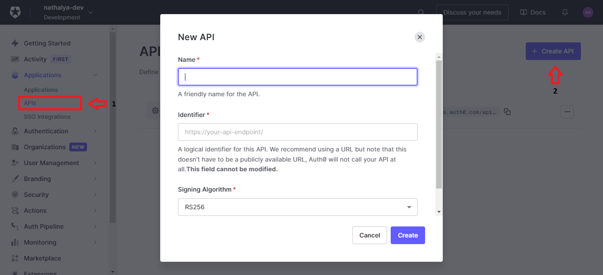

Para criar uma API, precisamos definir um identificador exclusivo. O Auth0 recomenda que utilize uma URL (não precisa estar disponível publicamente), porém atualmente seguimos o padrão de **api-nome-projeto**.

Quando clicado em uma API, somos redirecionados para as configurações e teremos algumas abas como:

| **Aba**                           | **Descrição**                                                                                                                                                                                                                                                                                                      |
| --------------------------------- | ------------------------------------------------------------------------------------------------------------------------------------------------------------------------------------------------------------------------------------------------------------------------------------------------------------------ |
| Configurações                     | Configura algumas informações em relação a API como o tempo de expiração do token e permitir o acesso offline                                                                                                                                                                                                      |
| Permissões                        | Define todas as permissões que são utilizadas pela API                                                                                                                                                                                                                                                             |
| Aplicações Máquinas para Máquinas | Lista todas as aplicações que poderão solicitar o [token de acesso](http://localhost:1313/documentacao/autorizacao/#token-de-acesso) para a API. As aplicações devem ser do tipo **Machine to Machine Application** ou **Regular Web Application** e é possível adicionar escopos/permissões para limitar o acesso |
| Teste                             | Faz uma requisição para gerar o token com um dos aplicativos autorizados na aba **Machine to Machine Applications** para verificar se tudo está funcionando corretamente                                                                                                                                           |
