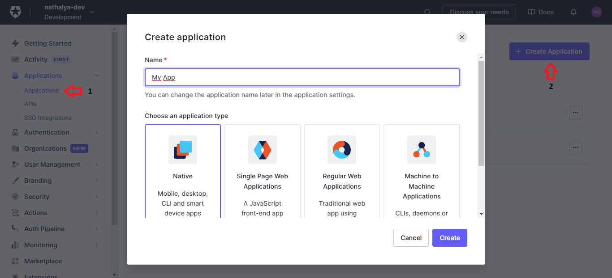

| **Tipo**                                 | **Descrição**                                                                                                                                                                                                                                                                         |
| ---------------------------------------- | ------------------------------------------------------------------------------------------------------------------------------------------------------------------------------------------------------------------------------------------------------------------------------------- |
| Nativo                                   | Aplicações que são desenvolvidas para um sistema específico (Android, iOS, Windows) e ficam armazenadas diretamente no dispositivo                                                                                                                                                    |
| Aplicativos da Web de página única (SPA) | São aplicações que ao invés de recarregar toda a página ou redirecionar o usuário para uma página nova, apenas o conteúdo principal é atualizado, mantendo toda a estrutura da página estática. Além disso, toda a lógica do front-end é executada em JavaScript no próprio navegador |
| Aplicativos Web Regulares                | São aplicativos web tradicionais que executam a maior parte da sua lógica no servidor                                                                                                                                                                                                 |
| Aplicativos máquina para máquina         | São aplicativos web tradicionais que executam a maior parte da sua lógica no servidor                                                                                                                                                                                                 |

## Single Page Web Application

Quando clicado em uma aplicação, somos redirecionados para as configurações e teremos algumas abas como:

- **Configurações:** configura todas as informações do aplicativo

- **Conexões:** habilita as conexões para o aplicativo. Essas conexões são as fontes de usuário (base de dados, rede social ou/e empresa) e podem ser compartilhados entre várias aplicações.

Nas configurações algumas informações são importantes para sua aplicação:

| **Configuração**       | **Descrição**                                                                                                                                                                             |
| ---------------------- | ----------------------------------------------------------------------------------------------------------------------------------------------------------------------------------------- |
| Domain                 | Nome do domínio de autenticação                                                                                                                                                           |
| Client ID              | Identificador da aplicação                                                                                                                                                                |
| Client Secret          | Protege os recursos concedendo tokens apenas a usuários autorizados. Ele não deve ser compartilhado com ninguém, pois a pessoa poderá emitir tokens e acessar recursos não autorizados!   |
| Allowed Callback URLs  | Quando o usuário fizer o login, ele poderá ser redirecionada para alguma das URLs definidas                                                                                               |
| Allowed Logout URLs    | Quando o usuário fizer o logout, ele poderá ser redirecionada para alguma das URLs definidas                                                                                              |
| Allowed Web Origins    | Indica quais URLs tem a permissão de solicitar a autenticação                                                                                                                             |
| Allowed Origins (CORS) | Conjunto de URLs que terão permissão para fazer solicitações de JavaScript para API Auth0 (normalmente usado com CORS). Por padrão todas as URLs em allowed callback URLs tem a permissão |

### Fluxo de Autenticação e Autorização

Os fluxos de autenticação e autorização são métodos pelos quais os aplicativos podem obter o [token de acesso](http://localhost:1313/documentacao/autorizacao/#token-de-acesso) e o [ID token](http://localhost:1313/documentacao/autenticacao/#id-token).

#### Sem token de acesso

Se a aplicação não precisar de um token de acesso, podemos utilizar o **_Implicit Flow with Form Post (Fluxo Implícito com postagem de formulário)_**:

1. O usuário clica em _Login_
2. O SDK do Auth0 redireciona o usuário para o servidor de autorização do Auth0 com os parâmetros:
   - `response_type: id_token` -> indica o tipo de credencial solicitada
   - `response_mode: form_post` -> garante a segurança
3. O servidor do Auth0 redireciona o usuário para a tela de login e autorização
4. O usuário se autentica usando uma das opções de login configuradas e consente as permissões necessárias
5. O servidor do Auth0 redireciona o usuário de volta a aplicação com um [ID token](http://localhost:1313/documentacao/autenticacao/#id-token)

#### Com token de acesso

Se a aplicação não precisar de um token de acesso, podemos utilizar o **_Authorization Code Flow with Proof Key for Code Exchange (Fluxo de código de autorização com chave de prova para troca de código)_**:

1. O usuário clica em _Login_
2. O SDK do Auth0 cria um arquivo criptografado aleatório _code_verifier_ e, a partir disso, gera um arquivo _code_challenge_
3. O usuário é redirecionado para o servidor de autorização do Auth0 com o _code_challenge_
4. O servidor do Auth0 redireciona o usuário para a tela de login e autorização
5. O usuário se autentica usando uma das opções de login configuradas e consente as permissões necessárias
6. O servidor de autorização do Auth0 armazena o _code_challenge_ e redireciona o usuário de volta para o aplicativo com um código de autorização
7. O SDK do Auth0 envia o código e o _code_verifier_ para o servidor de autorização do Auth0 pelo endpoint `/oauth/token`
8. O servidor verifica o _code_challenge_ e o _code_verifier_
9. O servidor redireciona o usuário de volta a aplicação com um [ID token](http://localhost:1313/documentacao/autenticacao/#id-token) e um [token de acesso](http://localhost:1313/documentacao/autorizacao/#token-de-acessp)

## Aplicações Confidenciais e Públicas

A principal difrença entre os dois tipos de aplicação está relacionado se o aplicativo pode ou não manter as credenciais seguras (client id e client secret). Isso irá afetar o tipo de autenticação que os aplicativos podem utilizar.

Uma aplicação confidencial utiliza um servidor back-end confiável e, consequentemente, pode realizar a autenticação especificando o **client id** e o **client secret** quando fizer a requisição para pegar o token de acesso.

Uma aplicação pública, só pode utilizar os tipos de autenticação que não precisam do **client secret** porque são aplicações que não podem manter a confialidade das credenciais exigidas.



Para verificar se o aplicativo é público ou confidencial, você pode ir em Applications -> Applications e selecionar a aplicação que deseja. Feito isso, em configurações temos o campo _Token Endpoint Authentication Method_ e nele temos 3 tipos de métodos:

- **None (nenhum):** aplicativo público sem _client secret_

- **Post:** aplicativo utiliza o parâmetro do _body_ da requisição para enviar o _client secret_

- **Basic:** aplicativo utiliza o esquema de autenticação _HTTP Basic_

Esses valores irão definir se são aplicativos públicos ou confidenciais:

| **Tipo de Aplicação** | **Exemplo**                                   | **_Token Endpoint Authentication Method_** |
| --------------------- | --------------------------------------------- | ------------------------------------------ |
| Público               | Single Page Application ou Nativo             | None (nenhum)                              |
| Confidencial          | Regular Web Application ou Machine to Machine | Basic e Post                               |

## Consentimento do Usuário

Se um usuário se autenticar por meio de um aplicativo de terceiros e o aplicativo solicitar autorização para acessar as informações do usuário ou realizar alguma ação em uma API em seu nome, será mostrado uma caixa de diálogo de consentimento no seu primeiro login ou se o consentimento for revogado explicitamente.

Por padrão, a página de consentimento usará os nomes dos escopos para solicitar o consentimento do usuário, porém se quiser mostrar a descrição também basta definir `use_scope_descriptions_for_consent` como **true**.

Caso o usuário rejeite o consentimento da aplicação, ele será redirecionado para o **redirect_uri** especificado na solicitação com o erro `access_denied`.

### Ignorar Consentimento

Caso seja um aplicativo de terceiro, não se pode ignorar a aba de consentimento pois essas aplicações não são consideradas confiáveis.

No caso de aplicações primárias, se não tiver o **localhost** na configuração _Allowed Callback URLs_ é possível ignorar o consentimento indo nas configurações da API (Aplications -> APIs) e habilitando a opção **_Allow Skipping User Consent_**.
