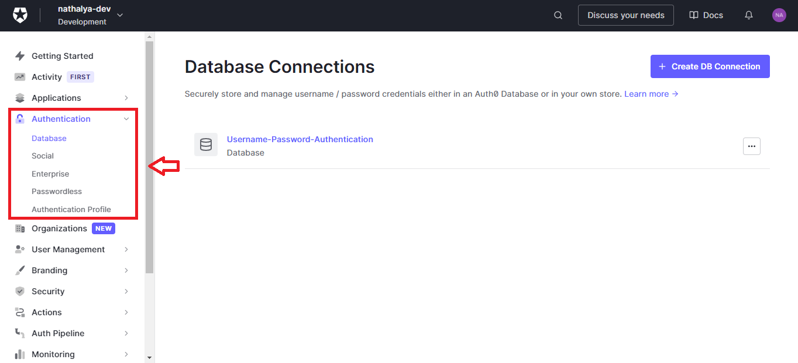
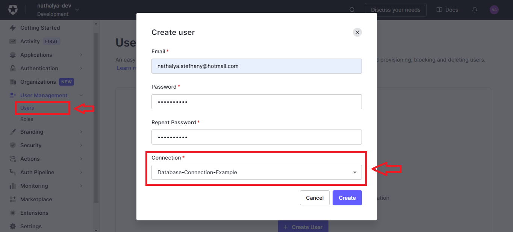

## Banco de dados

As configurações das conexões de bancos de dados podem ser feitas em Authentication -> Database.

Criado um banco de dados, se acessarmos ele, veremos a aba _Applications_. Nessa aba é possível definir quais aplicações irão utilizar o banco de dados para login.

### Adicionar usuário

Para adicionar um novo usuário no banco de dados, é necessário que pelo menos uma aplicação utilize o banco. Tendo uma aplicação, quando for criar um novo usuário é possível selecionar a conexão que deseja:

### Testar conexão

Para testar a conexão do banco, deve-se navegar para Authentication -> Database e clicar em um determinado banco. Feito isso, teremos a aba _Try Connection_ que te redirecionará para uma página de login para realizar o teste.
