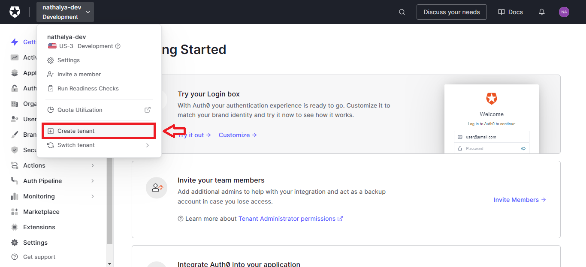
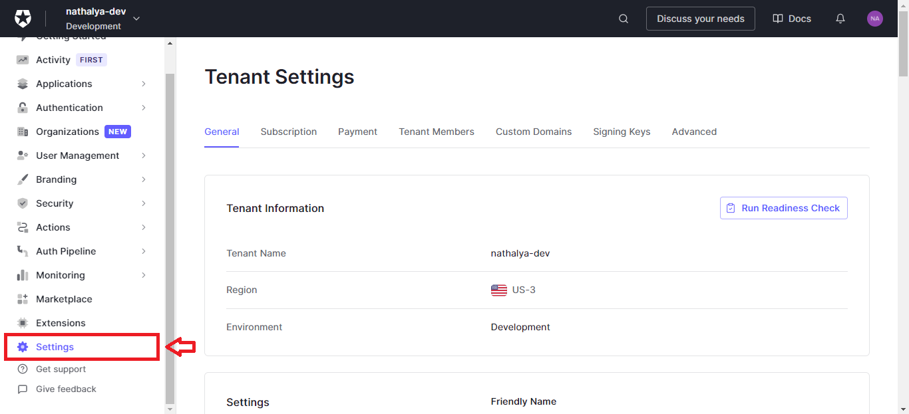



## Criação

Para criar um novo tenant, é necessário clicar no canto superior esquerdo que mostra em qual tenant está e lá teremos a opção de criar um novo.

Quando for definir o nome do tenant, é necessário ter certeza do nome pois ele será utilizado para criar o domínio (só é possível personalizar o domínio se tiver uma assinatura) e não pode ser alterado.

## Configurações

Caso queria editar, adicionar novos membros ou visualizar informações do tenant, basta ir em **Settings** pelo painel esquerdo ou pelo canto superior esquerdo no mesmo local que cria um novo.

É importante preencher os dados básicos como o nome que será exibido para o usuário em **Friendly Name**, adicionar a logo da empresa em **Logo URL** e adicionar o e-mail e url de suporte para o usuário conseguir entrar em contato (**Support Email** e **Support URL**).

Além disso, nas configurações avançadas, podemos definir se as sessões serão persistentes, ou seja, o usuário não precisará fazer o login novamente quando fechar e abrir o navegador. També, teremos a configuração para definir depois de quanto tempo deverá exigir o login novamente e o tempo máximo de inatividade.

