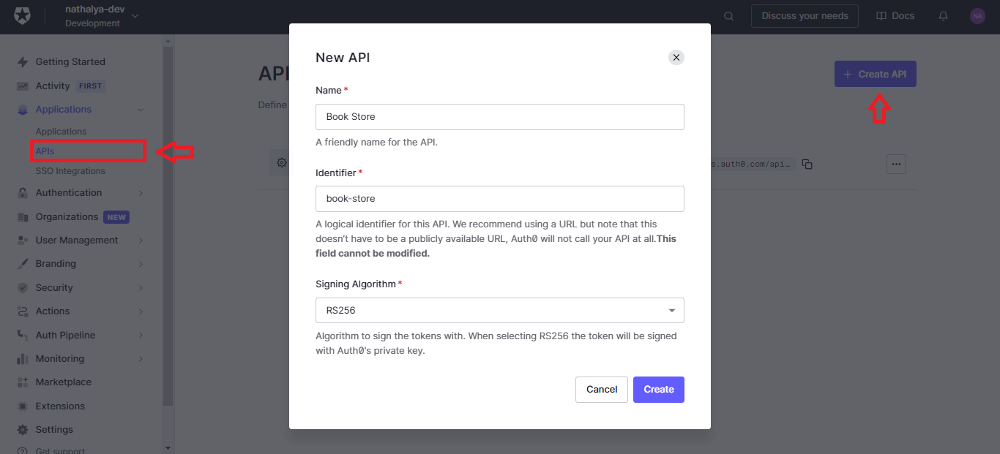
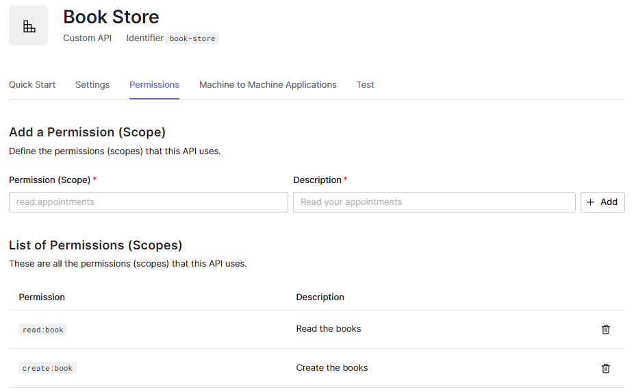
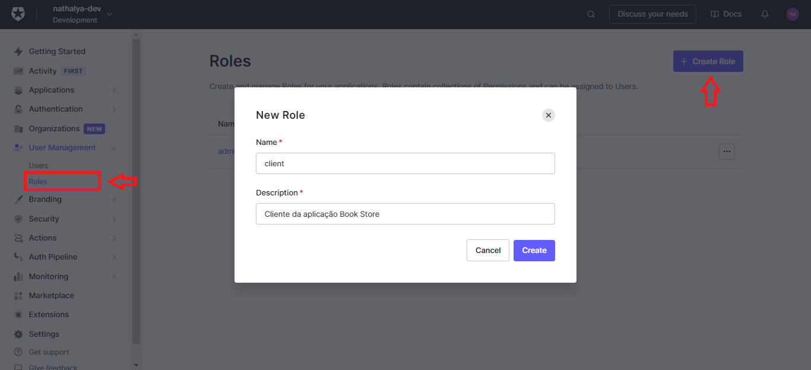
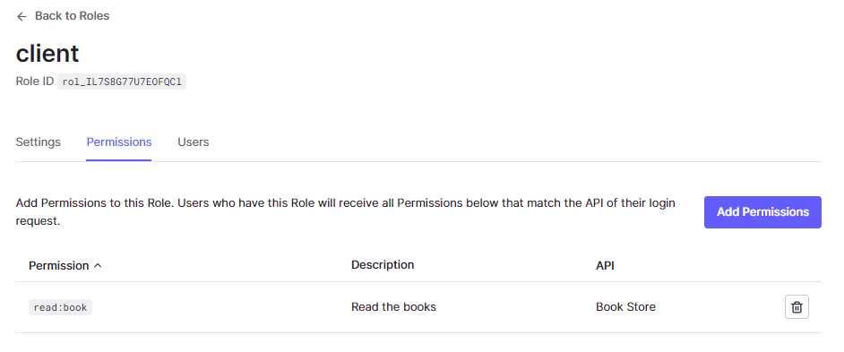
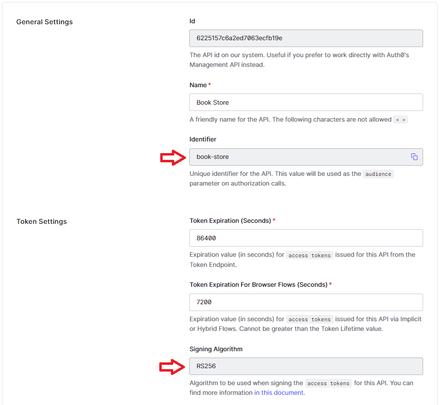
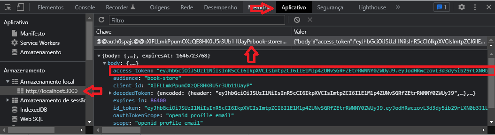

Para o tutorial, será desenvolvido uma API para que a aplicação criada à consuma.

Na api teremos 3 endpoints:

- `GET /book`: retorna todos os livros presente. Todos os usuários podem realizar a requisição.
- `POST /book`: adiciona um novo livro. Apenas o administrador tem permissão.
- `DELETE /book/:id`: deleta um livro a partir do ID. Apenas o administrador tem permissão.

O código da API que será desenvolvida nesse tutorial está disponível no repositório [Auth0](https://github.com/NathalyaStefhany/Auth0)

## Auth0

Como primeiros passos do desenvolvimento, iremos criar e configurar a API no auth0.

### Criando a API

O primeiro passo a se fazer é criar a nossa API no Auth0:



### Configurando as permissões

Quando criarmos a API, seremos redirecionado para as configurações. Nas configurações teremos a aba **_Permissions_** para criarmos todos os escopos que existirão na nossa aplicação: `read:book`, `create:book` e `delete:book`.



### Roles

A quantidade de escopos atualmente é pouca, então atribuir `read:book`, `create:book`, `delete:book` para todo o administrador e `read:book` para o cliente não é tão complicado. Porém, se houvesse mais tipos de usuários e escopos, o ideal seria criar uma **_Role_**. As **_roles_** irão agrupar todos os escopos de um determinado usuário em um só lugar, fazendo com que não esqueçamos de adicionar algum escopo para um determinado usuário ou adicionemos um errado.

Criar role:



Criado uma role, seremos redirecionados para as configurações. Nas configurações temos a aba **_Permissions_** em que iremos adicionar todos os escopos daquele tipo de usuário.



Para atribuir as **_roles_** no usuário, podemos ir na aba **_Users_** ou ir no usuário que deseja adicionar uma **_role_** e ir na aba **_Roles_**.

### Adicionando Roles e Escopos no Token de Acesso

Para que os papéis do usuário e suas permissões sejam passadas pelo token de acesso, devemos ativar, na configuração da API, as opções **_Enable RBAC_** e **_Add Permissions in the Access Token_**.

## Configurando a API em Node.js

Criação do package.json padrão:

```bash
yarn init -y

# OU

npm init -y
```

Para a api utilizaremos o framework express e as bibliotecas/middlewares:

- **_express-jwt:_** middleware utilizado para a validação de JWTs

- **_jwks-rsa:_** biblioteca utilizada para recuperar chaves de assinatura de um endpoint JWKS

### Validando o token de acesso

Para verificar se o token de acesso é válido podemos utilizar um middleware. O middleware é uma função que fica entre a requisição e a resposta da nossa API, ou seja, quando fizermos uma requisição, antes de começar a lógica do endpoint, será verificado se o token é válido, se for continua a execução da requisição, se não é retornado o erro 401 - Sem autorização para o caso da validação de token.

Para a validação do token, temos o middleware **_jwtCheck_** e como a validação ocorrerá em todos os endpoints, podemos configura-lo com `app.use(middleware)`

```js
// src/index.js

const express = require("express");
const jwt = require("express-jwt");
const jwks = require("jwks-rsa");

const app = express();

const jwtCheck = jwt({
  secret: jwks.expressJwtSecret({
    cache: true,
    rateLimit: true,
    jwksRequestsPerMinute: 5,
    jwksUri: `${process.env.AUTH0_ISSUER}.well-known/jwks.json`,
  }),
  audience: process.env.AUTH0_AUDIENCE,
  issuer: process.env.AUTH0_ISSUER,
  algorithms: ["RS256"],
});

app.use(jwtCheck);

app.listen(4000);
```

No middleware é necessário passar o **Audience/Identifier** e algoritmo a ser utilizado para assinar o token. Essas informações são encontradas na API:



Por último temos o **_issuer_** que é a URL do seu Auth0.

### Endpoints

Configurado o middleware, podemos criar os endpoints:

```js
// src/index.js

const express = require("express");
const cors = require("cors");
const { v4: uuidv4 } = require("uuid");
const jwt = require("express-jwt");
const jwks = require("jwks-rsa");

require("dotenv").config();

const app = express();

const jwtCheck = jwt({
  // validação do token
});

app.use(cors());
app.use(jwtCheck);
app.use(express.json());

app.get("/book", (request, response) => {
  // Lógica do endpoint
});

app.post("/book", (request, response) => {
  // Lógica do endpoint
});

app.delete("/book/:id", (request, response) => {
  // Lógica do endpoint
});

app.listen(4000);
```

## Configurando a aplicação

### Auth0Provider

Para a aplicação conseguir fazer uma requisição, a aplicação precisa mandar um token de acesso para a API que irá dizer que o usuário tem autorização. Para isso, precisamos passar no Auth0Provider mais um parâmetro, o audience:

```js
// components/Auth0Provider/index.tsx

import React from "react";

import { Auth0Provider as Provider } from "@auth0/auth0-react";

export const Auth0Provider: React.FC = ({ children }) => {
  const domain = process.env.REACT_APP_AUTH0_DOMAIN;
  const clientId = process.env.REACT_APP_AUTH0_CLIENT_ID;
  const redirectUrl = process.env.REACT_APP_AUTH0_REDIRECT_URL;
  const audience = process.env.REACT_APP_AUTH0_AUDIENCE;
  const envAuth0 = process.env.REACT_APP_ENV ?? "";

  return (
    <Provider
      domain={domain ?? ""}
      clientId={clientId ?? ""}
      redirectUri={redirectUrl}
      audience={audience}
      scope="openid profile email"
      cacheLocation={envAuth0 === "development" ? "localstorage" : "memory"}
    >
      {children}
    </Provider>
  );
};
```

### Token de Acesso

Passado o parâmetro do audience, já conseguimos acessar o token de acesso com os dados importantes no body. Para pegar o token, podemos realizar o login na nossa aplicação e ir nas ferramentas para desenvolvedor do navegador (F12). Em “aplicativo” teremos os dados armazenado localmente, sendo um deles o do Auth0. Se clicarmos, conseguiremos ver o token de acesso.



#### Decodificando o token

Se decodificarmos o token de acesso pelo [jwt.io](https://jwt.io/), teremos as seguintes informações em relação a criação do token:

- **_iss:_** quem criou e assinou o token
- **_sub:_** id do usuário
- **_aud:_** para quais APIs o token é válido
- **_iat:_** quando foi criado o token
- **_exp:_** quando o token irá expirar
- **_scope:_** as permissões do usuário

Além disso, teremos as informações do app_metadata e as permissões do usuário.

### Realizando as requisições

Ao fazer as requisições, é necessário passar no **_header_** o token de acesso. Para isso, temos a função `getAccessTokenSilently` do Auth0 que irá nos retornar esse token:

```js
const { getAccessTokenSilently } = useAuth0();

useEffect(() => {
  const getAccessToken = async () => {
    return getAccessTokenSilently({
      audience: process.env.REACT_APP_AUTH0_AUDIENCE,
      scope: "read:current_user",
    });
  };

  const token = getAccessToken();
}, [getAccessTokenSilently]);
```

Com o token, já podemos fazer a requisição para pegar os livros. O token deve ser passado no _Authorization_ com a junção de **_Bearer_** + token.

```js
const { getAccessTokenSilently } = useAuth0();

useEffect(() => {
  const getAccessToken = async () => {
    return getAccessTokenSilently({
      audience: process.env.REACT_APP_AUTH0_AUDIENCE,
      scope: "read:current_user",
    });
  };

  const getBooks = async () => {
    const token = await getAccessToken();

    api
      .get("/book", { headers: { Authorization: `Bearer ${token}` } })
      .then((response) => setBooks(response.data))
      .catch((err) => console.log(err));
  };

  getBooks();
}, [getAccessTokenSilently]);
```

## Verificando permissões

Atualmente, qualquer usuário pode fazer requisição a todos os endpoints da API pois só verificamos o token de acesso, porém devemos também analisar as permissões do usuário para verificar se pode ou não fazer a requisição.

### Escopos

Para validar o escopo, podemos utilizar o middleware **_express-jwt-authz_**. Nele temos a função `checkScope` que recebe como parâmetro um array de escopos que tem permissão de acessar o endpoint e as opções de configuração para acessar o escopo. Uma das opções é o **_customScopeKey_**, nele iremos passar chave que recebe os escopos. Para verificar qual é a chave, é necessário decodificar o token de acesso.

```bash
# permissions = chave
# [ ] = escopos

{
  "permissions": [
    "read:book"
  ]
}
```

Como cada endpoint terá um escopo diferente, podemos passar o middleware entre o endpoint e a função que é chamada para fazer a requisição.

```js
// src/index.js

const checkScope = require("express-jwt-authz");

let books = [];

const customScopeKey = "permissions";

app.get(
  "/book",
  checkScope(["read:book"], { customScopeKey }),
  (request, response) => {
    return response.json(books);
  }
);

app.post(
  "/book",
  checkScope(["create:book"], { customScopeKey }),
  (request, response) => {
    // Lógica do endpoint
  }
);

app.delete(
  "/book/:id",
  checkScope(["delete:book"], { customScopeKey }),
  (request, response) => {
    // Lógica do endpoint
  }
);
```

### App metadata

Outra maneira para verificar se tem permissão para executar o endpoint é através do app_metadata. Anteriormente, haviamos adicionado no app_metadata o tipo do usuário (admin ou client) para verificar quais abas os usuários conseguem acessar ([clique aqui](http://localhost:1313/tutorial/aplicacao/#app-metadata)). Se adicionarmos o app_metadata no token de acesso, podemos pegar o valor de roles e verificar se o usuário tem ou não permissão.

Para isso, primeiro devemos adicionar uma regra para colocar a informação dentro do token de acesso:

```js
function addAppMetadataToAccessToken(user, context, callback) {
  if (context.clientName !== "Book Store") {
    return callback(null, user, context);
  }

  user.app_metadata = user.app_metadata || {};

  var namespace = "https://www.book-store.com.br/";

  context.accessToken[namespace + "app_metadata"] = user.app_metadata;

  return callback(null, user, context);
}
```

Com o valor dentro do token, podemos criar um middleware para verificar as permissões:

```js
// src/index.js

const jwtDecode = require("jwt-decode");

let books = [];

// Middleware
const checkRole = (role) => {
  return (req, res, next) => {
    // Pega o token
    const token = req.headers.authorization;
    // Decodifica
    const tokenDecoded = jwtDecode(token);

    const namespace = "https://www.book-store.com.br/";
    // Pega a role do usuário
    const userRole = tokenDecoded?.[namespace + "app_metadata"]?.role;

    // Verifica se é a mesma que a do endpoint
    if (userRole !== role)
      return res.status(403).json({ error: "Insufficient role" });

    return next();
  };
};

const customScopeKey = "permissions";

app.get(
  "/book",
  checkScope(["read:book"], { customScopeKey }),
  (request, response) => {
    return response.json(books);
  }
);

app.post("/book", checkRole("admin"), (request, response) => {
  const { title, description } = request.body;

  const book = {
    id: uuidv4(),
    title,
    description,
  };

  books.push(book);

  return response.status(201).json(book);
});

app.delete("/book/:id", (request, response) => {
  // Lógica do endpoint
});
```
