Para o tutorial, será desenvolvido uma aplicação de loja de livros no qual teremos dois tipos de acesso: cliente e administrador.

Os administradores poderão adicionar, deletar e visualizar livros, enquanto os clientes poderão apenas visualizar os livros.

Pensando nisso, na parte do desenvolvimento da aplicação teremos as seguintes abas para o administrador: home, perfil, editar livro e visualizar livro. E para o usuário teremos: home, perfil e visualizar livro. Não é necessário fazer login para visualizar a aba **home**.

No Auth0 teremos:

- **Escopos:** `read:book`, `create:book`, `delete:book`, `openid profile email`
- **Roles:** administrador e cliente
- **App Metadata:** qual tipo de acesso o usuário tem

O código da aplicação que será desenvolvida nesse tutorial está disponível no repositório [Auth0](https://github.com/NathalyaStefhany/Auth0)

Para começar com o tutorial, certifique-se que tenha uma conta no [Auth0](https://auth0.com/signup?place=header&type=button&text=sign%20up).

## Auth0

Como primeiros passos do desenvolvimento, iremos criar e configurar a aplicação no auth0.

### Criando a aplicação

O primeiro passo a se fazer é criar a nossa aplicação no Auth0:

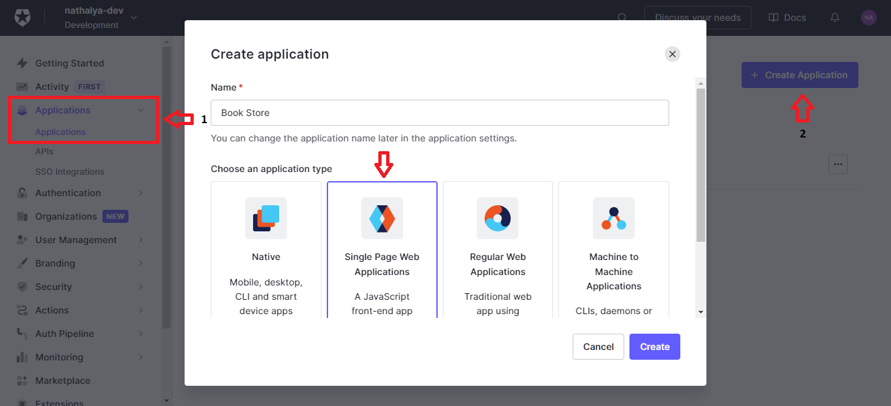

### Configurando a aplicação

Quando criarmos a aplicação, seremos redirecionado para as configurações.

Em **_Basic Information_** é possível alterar o nome e fazer uma breve descrição da aplicação.

Em **_Application Properties_** é possível alterar a logo da aplicação.

Em **_Application URIs_** vai ser definido as URLs que o usuário vai ser redirecionado quando fizer login/logout e quais URLs poderão ter acesso a essa aplicação:

- **_Allowed Callback URLs:_** quando o usuário (admin e cliente) for autenticado, será redirecionado para a aba **Livros**, url: http://localhost:3000/livros
- **_Allowed Logout URLs:_** quando o usuário fizer o logout, será redirecionado para a página **Home**, url: http://localhost:3000
- **_Allowed Web Origins:_** apenas o localhost (pois está em desenvolvimento) poderá acessar essa aplicação, url: http://localhost:3000

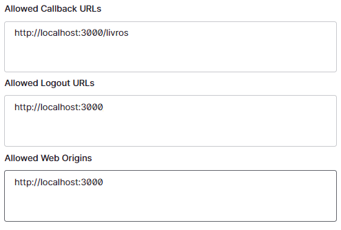

## Criando a aplicação em React

Criação da aplicação:

```bash
yarn create react-app frontend --template typescript

# OU

npx create-react-app frontend --template typescript
```

Com a aplicação criada, precisamos instalar o Auth0:

```bash
yarn add @auth0/auth0-react

# OU

npm install @auth0/auth0-react
```

## Autenticação

Feito as configurações da aplicação no Auth0 e criado uma aplicação em React, podemos implementar a autenticação.

### Auth0 Provider

Para gerenciar a autenticação dos usuários, a biblioteca do Auth0 disponibiliza o **Auth0Provider**, um _React Context_. Nele iremos configurar em qual aplicação do Auth0 iremos fazer a autenticação. Para isso, criaremos um componente que irá retornar o Auth0Provider com todas as configurações necessárias:



```jsx
// components/Auth0Provider/index.tsx

import React from "react";

import { Auth0Provider as Provider } from "@auth0/auth0-react";

export const Auth0Provider: React.FC = ({ children }) => {
  const domain = process.env.REACT_APP_AUTH0_DOMAIN;
  const clientId = process.env.REACT_APP_AUTH0_CLIENT_ID;
  const redirectUrl = process.env.REACT_APP_AUTH0_REDIRECT_URL;
  const envAuth0 = process.env.REACT_APP_ENV ?? "";

  return (
    <Provider
      domain={domain ?? ""}
      clientId={clientId ?? ""}
      redirectUri={redirectUrl}
      scope="openid profile email"
      cacheLocation={envAuth0 === "development" ? "localstorage" : "memory"}
    >
      {children}
    </Provider>
  );
};
```

As informações referentes ao _domain_, _clientId_ e _redirectUri_ podem ser encontradas na configuração da sua aplicação do Auth0:

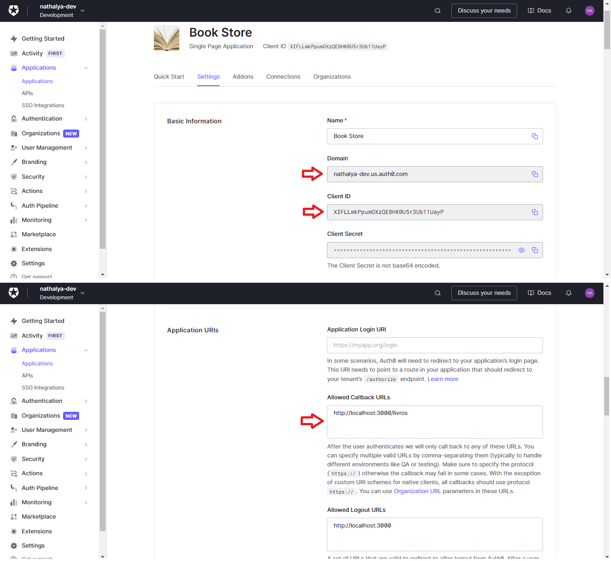

O _cacheLocation_ irá informar onde será armazenado os tokens de acesso. Ele é utilizado pelo time de teste, portanto, quando a aplicação estiver em dev, o token é armazenado no localstorage e o time de teste consegue acessar. Quando estiver em prod, fica na memória.

O _scope_ irá permite que tenhamos acesso ao perfil e e-mail do usuário.

Implementado o Auth0Provider, devemos adicioná-lo em volta de toda a nossa aplicação para que consigamos ter o seu acesso em todas as páginas:

```js
// index.tsx

import React from "react";
import ReactDOM from "react-dom";
import { App } from "./App";
import { Auth0Provider } from "./components/Auth0Provider";

ReactDOM.render(
  <React.StrictMode>
    <Auth0Provider>
      <App />
    </Auth0Provider>
  </React.StrictMode>,
  document.getElementById("root")
);
```

### Login

Para realizar o login do usuário, temos a função `loginWithRedirect()`:

```js
import React from "react";

import { useAuth0 } from "@auth0/auth0-react";

export const App = () => {
  const { loginWithRedirect } = useAuth0();

  return <button onClick={loginWithRedirect}>Login</button>;
};
```

Com essa função, quando o usuário fizer o login, ele vai ser redirecionado para a URL que colocamos no parâmetro _redirectUri_ do [_Auth0Provider_](http://localhost:1313/tutorial/aplicacoes/#configurando-o-auth0-provider).

### Opções de Login

Com a aplicação pronta para realizar o login, precisamos agora configurar os tipos de login que o usuário poderá fazer na aplicação. Para o projeto teremos duas opções: banco de dados e rede social - Google/Gmail.

#### Banco de Dados

O primeiro passo a se fazer é a criar um novo banco para a aplicação:

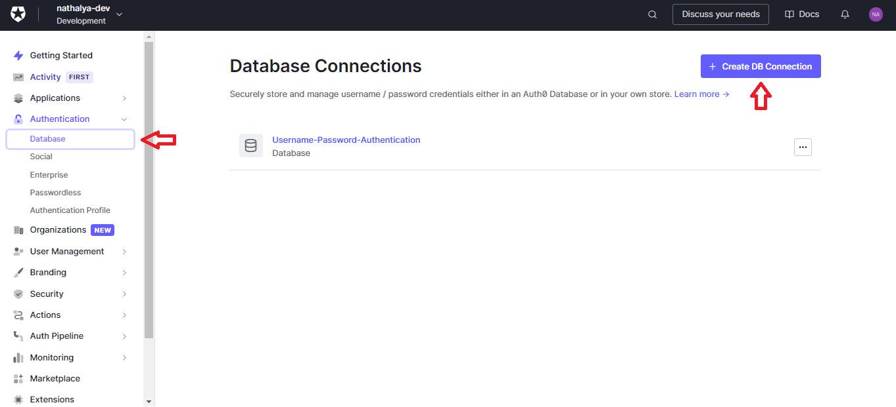

Quando clicar em criar, será pedido o nome da conexão e teremos duas opções de configuração:

- **_Require username_**: o usuário deverá fornecer um nome junto com o email.

- **_Disable Sign Up_**: define se o usuário poderá ou não criar uma conta na aplicação. Caso não possa, o desenvolverdor terá que criar uma conta para o usuário através do dashboard do Auth0.

No nosso caso, o usuário poderá criar uma conta e deverá fornecer um nome. Caso queira testar a conexão para verificar se é adicionado o campo username e se é permitido criar a conta, temos a aba **_Try Connection_** dentro das configurações do banco.

Criado o banco de dados para salvar os usuários, devemos dizer qual aplicação o utilizará:

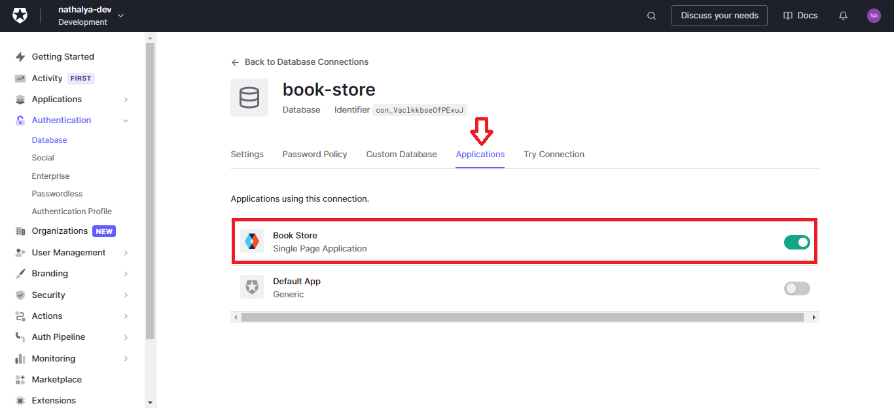

Também é possível visualizar essa configuração na aplicação:



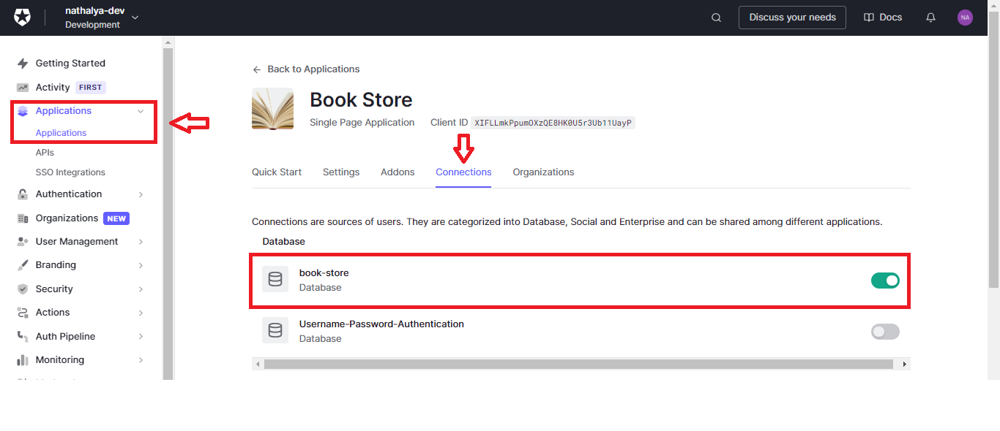

Caso queira criar uma conta a partir do Auth0, devemos definir em qual base o usuário se conectará:

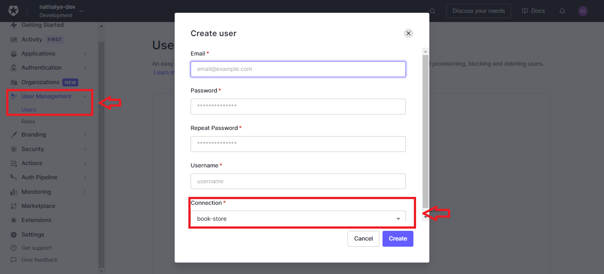

#### Rede Social

No Auth0, já temos como padrão a conexão do Google, porém podemos criar novas conexões (Facebook, LinkedIn, ...):

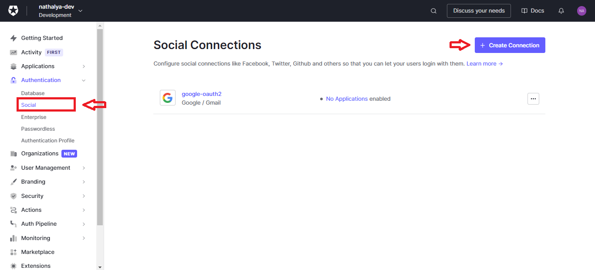

No nosso caso, utilizaremos o Google como segunda opção de autenticação. Quando clicamos na conexão, teremos duas abas:

- **_Settings:_** define quais permissões iremos pedir para o usuário para acessarmos alguns dados importantes da conta. Para a nossa aplicação, precisaremos apenas das informações básicas do perfil.

- **_Applications:_** defique quais aplicação utilizarão a conexão.

### Logout

Definido as opções de login, já podemos implementar o logout na nossa aplicação utilizando a função `logout`:

```js
import React from "react";

import { useAuth0 } from "@auth0/auth0-react";

export const App = () => {
  const { loginWithRedirect, logout } = useAuth0();

  return (
    <>
      <button onClick={loginWithRedirect}>Login</button>

      <button onClick={() => logout({ returnTo: window.location.origin })}>
        Logout
      </button>
    </>
  );
};
```

No `logout()` devemos passar como parâmetro a URL que o Auth0 irá utilizar para redirencionar o usuário depois que fizer o logout. Essa URL deve estar presente no campo **_Allowed Logout URLs_** da aplicação no Auth0 ([Configurando a aplicação no Auth0](http://localhost:1313/tutorial/aplicacoes/#configurando-a-aplica%c3%a7%c3%a3o-no-auth0)).

### Verificar se o usuário está autenticado

Atualmente, o botão de login e logout estão aparecendo junto, porém, o ideal é que apareça o logout quando o usuário tiver autenticado e login quando não tiver. Para isso temos a variável `isAuthenticated`:

```js
import React from "react";

import { useAuth0 } from "@auth0/auth0-react";

export const App = () => {
  const { loginWithRedirect, logout } = useAuth0();

  return (
    <>
      {isAuthenticated ? (
        <button onClick={() => logout({ returnTo: window.location.origin })}>
          Logout
        </button>
      ) : (
        <button onClick={loginWithRedirect}>Login</button>
      )}
    </>
  );
};
```

## Header

Implementado o botão de login e logout, conseguimos começar a desenvolver a navegação do usuário entre as abas da aplicação. Para isso, foi implementado o **_Header_**. Nele teremos uma condição para verificar se o usuário está autenticado para mostrar os menus privados (**Perfil**, **Livros** e **Editar**). Caso não esteja logado, o usuário terá acesso apenas a aba **Home**:

```js
// components/Layout/Header/index.tsx

import { useAuth0 } from "@auth0/auth0-react";
import { SignOut } from "phosphor-react";
import { useNavigate } from "react-router-dom";

import { Container, Menu } from "./styles";

export const Header = () => {
  const { isAuthenticated, logout, loginWithRedirect } = useAuth0();
  const navigate = useNavigate();

  return (
    <Container>
      <Menu>
        <li onClick={() => navigate("/")}>Home</li>

        {isAuthenticated && (
          <>
            <li onClick={() => navigate("/livros")}>Livros</li>
            <li onClick={() => navigate("/editar")}>Editar</li>
            <li onClick={() => navigate("/perfil")}>Perfil</li>
          </>
        )}
      </Menu>

      {isAuthenticated ? (
        <li onClick={() => logout({ returnTo: window.location.origin })}>
          <SignOut size={24} color="white" />
        </li>
      ) : (
        <li onClick={loginWithRedirect}>Login</li>
      )}
    </Container>
  );
};
```

## Rotas Públicas e Privadas

Se o usuário não tiver logado na aplicação, não vai ser renderizado os menus privados na tela, porém caso o usuário digite a URL da página privada, ele conseguirá acessá-la. Para resolver esse problema teremos as rotas privadas que irão verificar se o usuário foi autenticado, se tiver sido ele conseguirá acessar a rota, se não tiver ele é redirecionado para a página inicial.

Quando for chamado uma rota privada, será verificado se acabou o processo de autenticação (`isLoading === false`) e se o usuário foi autenticado (`isAuthenticated`). Se o usuário não tiver se autenticado ele será redirecionado para a página inicial, caso contrário, será renderizado a página que deseja acessar:

```js
// routes/privateRoute.tsx

import { useEffect } from "react";

import { useAuth0 } from "@auth0/auth0-react";
import { Route, useNavigate } from "react-router-dom";

import { PrivateRoutesProps } from "./types";

export const PrivateRoute = ({ element, ...props }: PrivateRoutesProps) => {
  const { isLoading, isAuthenticated } = useAuth0();

  const navigate = useNavigate();

  useEffect(() => {
    if (!isLoading && !isAuthenticated) navigate("/");
  }, [isLoading, isAuthenticated, navigate]);

  return <Route element={element} {...props} />;
};
```

Implementado a lógica das rotas privadas, conseguimos agora construir todas as rotas da aplicação separando-as em públicas e privadas:

```js
// routes/index.tsx

import { Route, Routes as ReactRoutes } from "react-router-dom";

import { PrivateRoute } from "./privateRoute";

import { Home } from "../pages/Home";
import { Books } from "../pages/Books";
import { Edit } from "../pages/Edit";
import { Profile } from "../pages/Profile";

export const Routes = () => {
  return (
    <ReactRoutes>
      <Route path="/" element={<Home />} />

      <PrivateRoute path="/livros" element={<Books />} />
      <PrivateRoute path="/editar" element={<Edit />} />
      <PrivateRoute path="/perfil" element={<Profile />} />
    </ReactRoutes>
  );
};
```

## App Metadata

Atualmente, todos os usuários logados conseguem acessar a aba **_Editar_**, porém apenas o administradores deveriam ter esse acesso. Para resolver isso, iremos configurar o app_metadata para definir o tipo de usuário: administrador ou cliente.

Para configurar o app_metadata, devemos ir nas configurações do usuário que deseja adicionar o tipo administrador ou cliente:

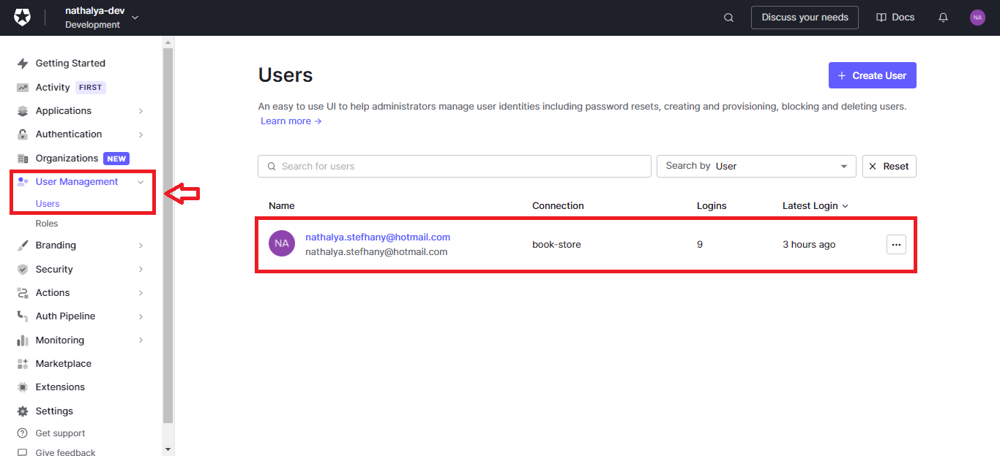

Clicado no usuário, teremos na aba **_Details_** os campos de **_Metadata_**. Como o metadata que queremos adicionar não deve ser alterado pelo usuário por ser uma informação de autorização, iremos adicioná-lo no _app_metada_. Nesse caso, teremos a chave **_role_** que irá receber **_admin_** ou **_client_**:

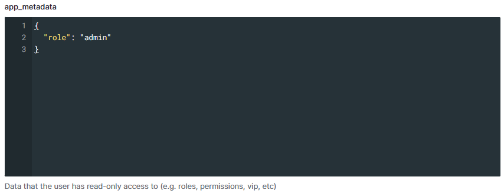

### Regras

#### Adicionando o app_metadata no ID token

Agora, o usuário já tem a informação se ele é um admin ou cliente, porém, precisamos conseguir pegar essa informação na nossa aplicação para verificar se ele poderá ou não acessar a aba _Editar_.

Para conseguir pegar as informações contidas no app_metada, podemos criar uma regra para adicioná-las no token ID.



[Why is my access token not a JWT? (Opaque Token)](https://community.auth0.com/t/why-is-my-access-token-not-a-jwt-opaque-token/31028)

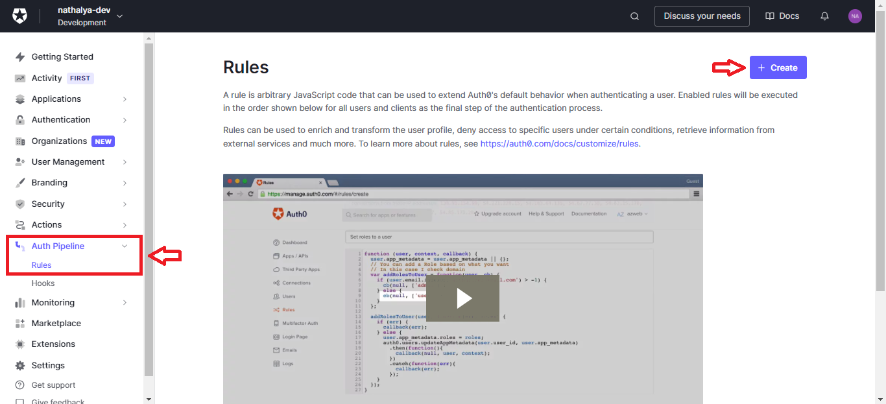

Quando clicarmos em criar uma nova regra, teremos vários templates para utilizar porém irei criar uma do zero com o nome "_Add app metadata to id token_".

```js
function addAppMetadataToIdToken(user, context, callback) {
  if (context.clientName !== "Book Store") {
    return callback(null, user, context);
  }

  var namespace = "https://www.book-store.com.br/";

  context.idToken[namespace + "app_metadata"] = user.app_metadata;

  return callback(null, user, context);
}
```

As regras são funções JavaScript que contém dois parâmetros importantes:

- **_user:_** contém informações relacionado ao usuário ([Informações presente no user](https://auth0.com/documentacao/customize/rules/user-object-in-rules))
- **_context_**: contém informações relacionado a aplicação ([Informações presente no context](https://auth0.com/documentacao/customize/rules/context-object))

Com o parâmetro _context_ conseguimos verificar qual aplicação está executando a regra (_clientName_) e, através disso, definir se é para continuar com a execução ou não. Isso porque as regras são executadas em todas as aplicações que temos no Auth0 depois da autenticação do usuário.

Se a aplicação que está executando tiver o nome **Book Store**, iremos adicionar a informação do **app_metadata** no id token. Para adicionar essa informação no token, é recomendado colocá-lo em uma variável com o nome no formato **_namespace + nome_** para que a informação adicionada não de conflito com qualquer outra informação que tenha o mesmo nome. O _namespace_ deve ser uma URL HTTP ou HTTPS.

#### Adicionando função do usuário no app_metadata

Atualmente, estamos adicionando o tipo de usuário na mão pelo dashboard do Auth0, mas podemos criar uma regra em que quando o usuário criar a conta dele, ele será automaticamente definido como **cliente**:

```js
function addRoleInAppMetadata(user, context, callback) {
  if (context.clientName !== "Book Store") return callback(null, user, context);

  user.app_metadata = user.app_metadata || {};

  const role = user.app_metadata.role;

  if (role) return callback(null, user, context);

  user.app_metadata.role = "client";

  auth0.users
    .updateAppMetadata(user.user_id, user.app_metadata)
    .then(function () {
      callback(null, user, context);
    })
    .catch(function (err) {
      callback(err);
    });
}
```

Com essa regra, quando o usuário fizer o login ou criar uma conta, será verificado se o usuário já tem o valor em _role_. Se não tiver, é adicionado o valor **client**.

Agora, temos duas regras: uma para adicionar os valores do app_metadata no id token e outra para adicionar um valor no app_metadata. Para que as regras tenham o comportamento esperado, é importante que coloquemos as regras na ordem de execução, ou seja, é necessário que a regra que adiciona a função do usuário no app_metadata esteja em primeiro para que o valor que foi adicionado apareça no id token (segunda regra).

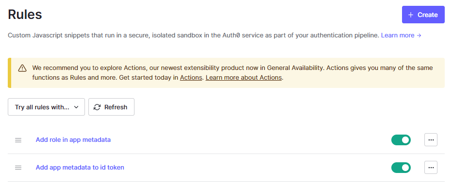

### Conferindo o ID Token

Para confirmarmos que a regra está funcionando corretamente, podemos realizar o login na nossa aplicação e ir nas ferramentas para desenvolvedor do navegador (F12). Em "aplicativo" teremos os dados armazenado localmente, sendo um deles o do Auth0. Se clicarmos, conseguiremos ver duas informações:

- **_decoded_token:_** temos o id token decodificado e com isso conseguimos ver as informações presente nele.
- **_id_token:_** temos o id token ainda condificado. Caso queira decodificar, adicione o token no debugger do [jwt.io](https://jwt.io/).

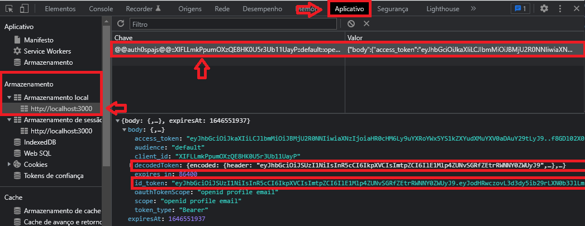

### Definindo quando mostrar a aba Editar

Adicionado o tipo de usuário pelo **_app_metadata_**, iremos agora pegar essa informação na aplicação para verificar se deve ou não mostrar a aba Editar. Para isso temos o parâmetro **user** que retorna um objeto com todas as informações do id token.

```js
// components/Layout/Header/index.tsx

export const Header = () => {
  const { isAuthenticated, logout, loginWithRedirect, user } = useAuth0();
  const navigate = useNavigate();

  const namespace = "https://www.book-store.com.br/";

  return (
    <Container>
      <Menu>
        <li onClick={() => navigate("/")}>Home</li>

        {isAuthenticated && (
          <>
            <li onClick={() => navigate("/livros")}>Livros</li>

            {user?.[namespace + "app_metadata"]?.role === "admin" && (
              <li onClick={() => navigate("/editar")}>Editar</li>
            )}

            <li onClick={() => navigate("/perfil")}>Perfil</li>
          </>
        )}
      </Menu>

      {/* Continuação do código */}
    </Container>
  );
};
```

```js
// Routes/privateRoute.tsx

import { useEffect } from "react";

import { useAuth0 } from "@auth0/auth0-react";
import { Route, useNavigate } from "react-router-dom";

import { PrivateRoutesProps } from "./types";

export const PrivateRoute = ({
  element,
  admin = false,
  ...props
}: PrivateRoutesProps) => {
  const { isLoading, isAuthenticated, user } = useAuth0();

  const navigate = useNavigate();
  const namespace = "https://www.book-store.com.br/";

  useEffect(() => {
    if (!isLoading && !isAuthenticated) navigate("/");

    if (admin && user?.[namespace + "app_metadata"]?.role !== "admin")
      navigate("/");
  }, [isLoading, isAuthenticated, navigate, admin, user]);

  return <Route element={element} {...props} />;
};
```

## Perfil

Caso queira criar um perfil para o usuário, podemos pegar seus dados pelo parâmetro **_user_** do Auth0 que retornará todos os dados que temos no ID token:

```js
// pages/Profile/index.tsx

import { useAuth0 } from "@auth0/auth0-react";

import { Container, Content } from "./styles";

export const Profile = () => {
  const { user } = useAuth0();

  return (
    <Container>
      <Content>
        
        <h1>Bem vindo {user?.name}</h1>
      </Content>

      <p>
        <b>E-mail:</b> {user?.email}
      </p>
    </Container>
  );
};
```

Atualmente, temos poucas informações, mas caso queira adicionar mais podemos requisitar essas informações pelo **_scope_** definido no **_Auth0Provider_**.
